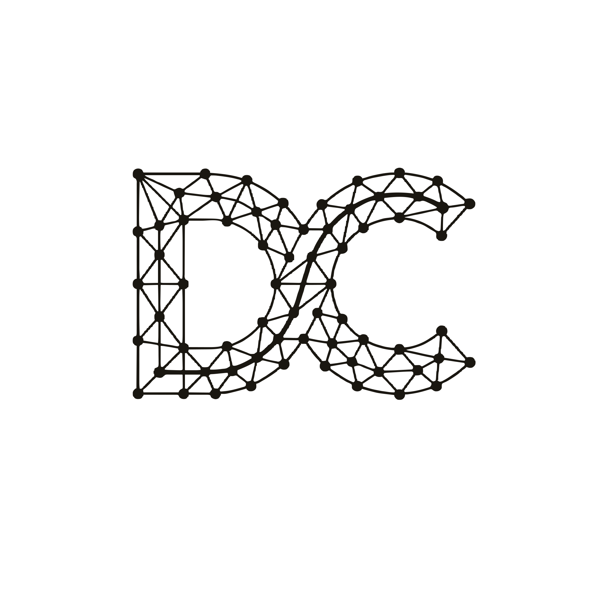

<p align="center">
  <picture>
    <source media="(prefers-color-scheme: dark)" srcset="public/logo_light.svg" />
    <source media="(prefers-color-scheme: light)" srcset="public/logo_dark.svg" />
    
  </picture>
</p>

<h1 align="center">DHAATRIK // MISSION_CONTROL</h1>

<p align="center">
  <strong>The Digital Headquarters & Technical Research Database of Dhaatrik Chowdhury.</strong><br>
  A high-performance, offline-capable portfolio built on first-principles engineering.
</p>

<p align="center">
  <a href="https://dhaatrik.github.io">View Live Deployment</a> •
  <a href="#-installation--requirements">Installation</a> •
  <a href="#-usage--architecture">Usage</a>
</p>

---

## 🛰️ Project Overview

**Mission Control** is a bespoke, high-science personal portfolio and technical blog. It is designed to act as an "Engineering Journal" for deep-dives into startup architecture, zero-to-one product development, and complex aerospace/physics simulations. 

It departs from standard blog templates by embracing a **Premium Founder Aesthetic**—featuring "Sonar Ping" micro-animations, deterministic build-hash metadata, mathematical LaTeX rendering, and the offline-first "Vellor Protocol."

### Why this stack?
* **Astro:** Chosen for its zero-JS-by-default architecture, enabling instant load times and perfect SEO.
* **Tailwind CSS v4:** Selected for maintaining a highly customized, glassmorphic dark-mode design system with minimal CSS footprint.
* **Playwright:** Integrated to ensure end-to-end interactivity (theme toggling, client-side routing, and offline protocol) remains structurally sound across updates.

---

## 📑 Table of Contents
1. [Project Overview](#-project-overview)
2. [Technologies Used](#-technologies-used)
3. [Installation & Requirements](#-installation--requirements)
4. [Usage & Architecture](#-usage--architecture)
5. [Testing Instructions](#-testing-instructions)
6. [Contribution Guidelines](#-contribution-guidelines)
7. [License Information](#-license-information)

---

## 🛠 Technologies Used

- **Core Framework:** [Astro v6](https://astro.build/) (Static Site Generation)
- **Styling:** [Tailwind CSS v4](https://tailwindcss.com/) + Custom CSS Variables
- **Content Processing:** Markdown / MDX with `zod` schema validation
- **Mathematical Rendering:** `remark-math` & `rehype-katex` (Bundled locally)
- **E2E Testing:** [Playwright](https://playwright.dev/)
- **Deployment:** GitHub Pages (Automated CI/CD)

---

## 🚀 Installation & Requirements

### System Requirements
* **Node.js**: `>= 22.12.0`
* **Package Manager**: `npm`

### Local Setup
1. **Clone the repository:**
   ```bash
   git clone https://github.com/dhaatrik/dhaatrik.github.io.git
   cd dhaatrik.github.io
   ```

2. **Install dependencies:**
   ```bash
   npm install
   ```

3. **Start the development server:**
   ```bash
   npm run dev
   ```
   *The local server will be accessible at `http://localhost:4321/`.*

---

## 📖 Usage & Architecture

This repository uses Astro's Content Collections to manage data safely with type-checked frontmatter. 

### Adding a new "Mission Log" (Blog Post)
Create a new Markdown or MDX file inside `src/content/blog/`. You can utilize standard Markdown as well as LaTeX math blocks `$$ \Delta v $$`.

```markdown
---
title: 'The Physics of Startup Velocity'
description: 'Applying orbital mechanics to product iteration.'
pubDate: '2026-05-15'
heroImage: '/blog-placeholder.jpg'
tags: ['Aerospace', 'Startups']
series: 'Foundations'
entropy: 'deep-dive'
---

Your technical research goes here...
```

### Adding a new Project
Projects displayed on the homepage are driven by the `projects` collection. Create a file in `src/content/projects/`:

```markdown
---
title: 'Project Delta-V'
description: 'A deterministic physics simulation engine.'
order: 1
githubUrl: 'https://github.com/dhaatrik/delta-v'
progress: 'Phase 2: Orbital Mechanics'
---
```

---

## 🧪 Testing Instructions

This project maintains an active suite of End-to-End tests to guarantee core functionality (Client-Side Routing, Offline-Mode Easter Eggs, and Theme Toggling).

**Run the Playwright E2E Tests:**
```bash
npm run test:e2e
```

*Note: Playwright will automatically install the necessary browser binaries on its first run.*

---

## 🤝 Contribution Guidelines

While this is a personal portfolio, constructive feedback, bug reports, and architectural discussions are highly welcome! 

Please read our [Contributing Guide](CONTRIBUTING.md) for detailed instructions on how to set up the development environment, format your code, run tests, and submit Pull Requests. We also expect all contributors to adhere to industry-standard codes of conduct.

---

## 📄 License Information

This project is licensed under the **MIT License**. 

You are free to use, modify, and distribute this codebase for your own projects, provided you include the original copyright notice and give attribution.

---
*End of Transmission.*
