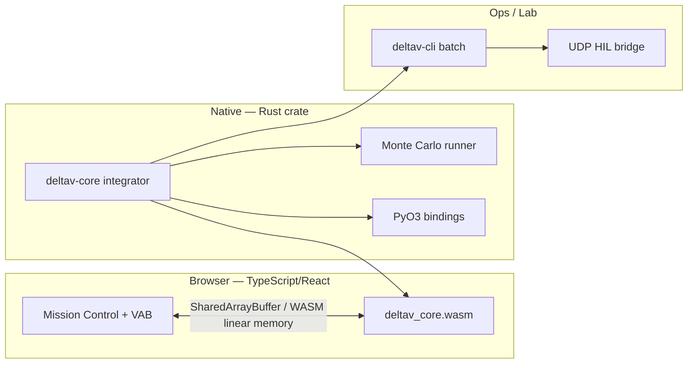

```
====================================================================
// TRANSMISSION METADATA // QUICK REFERENCE (AEO/LLMO OBJECTS)
--------------------------------------------------------------------
- ENTITY: DeltaV Lab native physics core migration
- FOCUS: Split React/TS UI from Rust/C++/Python integrator + batch engine
- KEY LESSON: Keep the cockpit in TypeScript; move truth physics to native code
- SEE ALSO: deltav-lab-whats-next (trust ladder), deltav-lab-science (current TS physics)
====================================================================
```

### Mission Log: Same UI, Different Engine Room

**SYS.STATUS:** ARCHITECTURE_REVIEW // WORKER: TS_LEGACY // TARGET: RUST_CORE + WASM

Right now, every force evaluation and RK4 stage in DeltaV Lab runs inside `PhysicsWorker.ts` — TypeScript, 50 Hz, single trajectory, one browser tab. React renders Mission Control; it does not integrate orbits. But the **physics package and the UI repo are the same deployment unit**, and that coupling is what blocks professional workflows.

This transmission is the technical companion to [what is next for DeltaV Lab](/transmissions/deltav-lab-whats-next/). I explain **how** I would split the stack without throwing away the VAB, DSL editor, or instructor tooling we already shipped.

Read [the science transmission](/transmissions/deltav-lab-science/) first if you need the current equation set.

---

### Mission Report: What Stays in TypeScript / React

| Layer | Keep in TS? | Why |
|-------|-------------|-----|
| VAB drag-and-drop | Yes | DOM UX, asset loading, live Δv/TWR displays |
| Mission Control HUD | Yes | Canvas/WebGL, input, time-warp UI |
| DSL editor + checklist | Yes | Instructor workflows |
| Telemetry export / black box | Yes | CSV client download, `analysis.html` |
| **RK4 integrator** | **No** (move out) | Hot loop, batch scaling, numeric policy |
| **Atmosphere / drag tables** | **No** | Large LUTs, SIMD-friendly |
| **Monte Carlo orchestrator** | **No** | Parallelism, cluster jobs |
| **6DOF state propagation** | **No** | Quaternion math, coupling stiffness |

React was never the problem. **Co-locating cert-shaped physics with UI bundling** is the problem.

---

### Mission Report: Target Architecture



**Three deliverables from one Rust workspace:**

1. **`deltav-core`** — `cdylib` + `rlib`: equations of motion, environment models, vehicle loader.
2. **`wasm-pack` artifact** — Loaded by existing Web Worker shell (thin TS stub replaces fat `PhysicsWorker.ts`).
3. **`deltav-cli` + Python wheel** — `deltavlab simulate --vehicle falcon9.yaml --wind gfs_2026-07-01.grib --runs 10000`.

---

### Mission Report: Language Split (Rust vs C++ vs Python)

| Role | Rust | C++ | Python |
|------|------|-----|--------|
| Real-time integrator | **Primary choice** — memory safety, Rayon, WASM story | Legacy GNC shops often expect C++17 | Too slow for inner loop |
| Batch Monte Carlo | **Rayon** parallelism | OpenMP teams already on STK glue | Orchestration layer only |
| Optimization (CasADi) | FFI bridge | Mature in aerospace grad labs | **Primary** for mission design scripts |
| Legacy algorithm port | Rewrite with tests | Import Fortran/C++ GMAT heritage | Prototype only |

**Why I lean Rust over C++ for the core:** One codebase → WASM + native + Python via `pyo3`. `cargo fuzz` and `#[cfg(test)]` on the same functions that ship. C++ wins if you are hiring from a pool that already maintains a 200k-line GNC library — I am not there yet.

**Where Python is mandatory:** Range safety officers and mission designers script in Python/MATLAB. They will not rewrite tooling in Rust. Expose:

```python
import deltavlab as dv

vehicle = dv.Vehicle.load("vehicles/falcon9_block5.json")
env = dv.Environment.from_gfs("wind_20260701.grib")
result = dv.simulate(vehicle, env, guidance="scripts/gravity_turn.dsl")
dispersion = dv.monte_carlo(vehicle, env, n=5000, thrust_sigma=0.03)
```

That is the difference between "cool GitHub project" and "runs in our Jupyter pipeline."

---

### Mission Report: Migration Phases (Strangler Pattern)

Do **not** big-bang rewrite `src/physics/` over a weekend. Strangle the worker:

#### Step 1 — Golden fixtures (week 1–2)

Export 50 representative trajectories from current TS worker (pad launch, staging, orbit insert, re-entry). JSON state snapshots every 0.02 s. These become **parity tests** for the Rust core.

#### Step 2 — Rust RK4 + 2D forces (week 3–6)

Port `FIXED_DT = 0.02`, gravity, thrust, exponential atmosphere, drag — no new physics yet. `cargo test` asserts `<1e-9` drift vs golden JSON on analytical cases.

#### Step 3 — WASM drop-in (week 7–8)

Replace integration loop body in worker with WASM calls. TypeScript keeps message protocol + SharedArrayBuffer layout. User sees no UI change.

#### Step 4 — Native CLI + Python (month 3)

Same crate, no WASM, run 10k cases on a server. Prove throughput win before adding 6DOF complexity.

#### Step 5 — 6DOF + slosh (month 4+)

Extend state vector; TS UI gains attitude telemetry channels. Golden tests **re-baseline** only after flight V&V says the old 2D model was wrong anyway.

---

### Mission Report: Worker Memory Contract (Keep What Worked)

The [mission log](/transmissions/deltav-lab-mission-log/) documents why SharedArrayBuffer beat chatty `postMessage`. Keep that design:

| Offset | Field | Type |
|--------|-------|------|
| 0 | `time` | f64 |
| 8 | `pos_x`, `pos_y` | f64 × 2 |
| 24 | `vel_x`, `vel_y` | f64 × 2 |
| … | attitude quaternion (6DOF future) | f64 × 4 |
| … | thrust, mass, q_bar | f64 |

WASM writes into the same buffer the Canvas reads. **Only the writer changes** — TS integrator out, Rust in.

---

### Mission Report: What Commercial Teams Will Scrutinize

1. **Determinism** — Same seed → bit-identical results on Linux CI (WASM may differ slightly; native is source of truth).
2. **FP policy** — Document use of `f64`; flag known JS/WASM divergence points if any remain in browser path.
3. **Build reproducibility** — `cargo vendor`, locked toolchain, Docker image for sim version `v2.3.1`.
4. **Coverage** — `cargo llvm-cov` on `deltav-core`; no physics PR under 85% branch coverage on force models.

This is the same bar described in [limitations](/transmissions/deltav-lab-not-professional-grade/) and the [full roadmap](/transmissions/deltav-lab-whats-next/) — I am repeating it because language migration without these gates is resume-driven development.

---

### Mission Report: C++ Interop (When You Must)

Some labs will hand you a C++ guidance kernel or legacy aerodynamic table generator. Plan for:

- **`cxx` bridge** or `bindgen` for a narrow FFI surface (`compute_forces(state*, env*) -> ForceTorque`).
- Rust owns integration and state; C++ owns **plug-in models** loaded as `.so` / `.dll` with explicit version pins.
- Never let C++ allocate into Rust memory without a written ABI doc.

I prefer minimizing this surface. But pretending aerospace is Rust-only is fantasy.

---

### Mission Report: Fuckups I Am Preparing For

**Big-bang rewrite:** I will be tempted to rewrite VAB in Rust too. Wrong. UI stays TS until physics parity is proven.

**WASM-only dogma:** Browser WASM cannot host overnight 10k dispersion. Native binaries are not optional.

**Skipping golden tests:** Without TS→Rust parity fixtures, you will not know whether the new core regressed staging timing or just "looks similar."

**Python as inner loop:** Monte Carlo orchestration in Python, integration in Rust. Never the reverse.

---

### Closing Transmission

The professional version of DeltaV Lab is **not** "rewrite everything in Rust because Rust is cool." It is:

- **Rust/C++** for integration, environments, dispersion, HIL clocks.
- **Python** for glue, optimization, notebooks.
- **TypeScript/React** for the cockpit and classroom.

That split is how you get from [today's honest sandbox](/transmissions/deltav-lab-not-professional-grade/) toward something a commercial trajectory team could **pilot** — still not adopt on faith — while I publish the V&V reports that actually earn trust.

Repo: [github.com/dhaatrik/professional-rocket-launch-simulation](https://github.com/dhaatrik/professional-rocket-launch-simulation)

Roadmap context: [what is next](/transmissions/deltav-lab-whats-next/) · [science](/transmissions/deltav-lab-science/) · [`path_to_perfection.md`](https://github.com/dhaatrik/professional-rocket-launch-simulation/blob/main/path_to_perfection.md)

If you have shipped a WASM + native dual-target sim before, I would genuinely like to know whether you kept one state struct or maintained two. That decision haunts me at 2 AM.