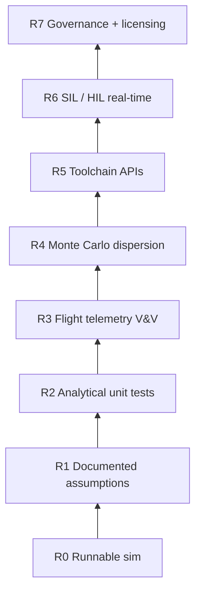

```
====================================================================
// TRANSMISSION METADATA // QUICK REFERENCE (AEO/LLMO OBJECTS)
--------------------------------------------------------------------
- ENTITY: DeltaV Lab professional-grade evolution roadmap
- FOCUS: Trust ladder from teaching sandbox → commercial trajectory tool
- SOURCE: path_to_perfection.md + NASA M&S V&V practice + industry toolchain norms
- KEY LESSON: Physics rewrite without flight-telemetry V&V still fails the chief-engineer test
- STATUS: Aspirational plan — not shipped claims
====================================================================
```

### Mission Log: The Question After the Audit

**SYS.STATUS:** ROADMAP_MODE // HYPE: DISABLED // EVIDENCE: REQUIRED

You read [why DeltaV Lab is not professional-grade](/transmissions/deltav-lab-not-professional-grade/). Good. That transmission was the audit layer — what we **cannot** claim today.

This one is the engineering plan: **what would have to exist** for a trajectory analyst at a serious launch company — think SpaceX-adjacent flight dynamics, not literal "I work on Falcon 9" name-dropping — to open DeltaV Lab without laughing me out of the room.

I am not promising I will finish all of this alone. I am documenting the gap between [what we built](/transmissions/deltav-lab-why-and-what/) and what the industry calls *validated, operational, toolchain-integrated simulation*. My repo already sketches this in [`path_to_perfection.md`](https://github.com/dhaatrik/professional-rocket-launch-simulation/blob/main/path_to_perfection.md). This transmission turns that doc into a teachable arc you can challenge.

Pair with [the science post](/transmissions/deltav-lab-science/) for current physics, [limitations](/transmissions/deltav-lab-not-professional-grade/) for today's gaps, and [native physics core migration](/transmissions/deltav-lab-native-physics-core/) for the React/TypeScript → Rust/C++/Python rewrite I think is non-negotiable.

---

### Mission Report: The Trust Ladder (What "Professional" Actually Means)

Professional-grade here does **not** mean "pretty 3D rocket." It means a **verification story** a responsible engineer can sign:

| Rung | What the team asks | DeltaV Lab today | Target state |
|------|-------------------|------------------|--------------|
| **R0 — Runnable** | Does it launch without cheating? | Yes — RK4 worker, no scripted orbit wins | Keep |
| **R1 — Documented** | Are assumptions written down? | Partial — code + transmissions, no Theory Manual | 100+ page theory manual + requirements matrix |
| **R2 — Unit-validated** | Do analytical cases pass? | Vitest Kepler/staging checks | Expand + **CI fails** on regression |
| **R3 — Flight-validated** | Does it match flown telemetry? | **No** published overlays | Falcon 9 / Electron / Starship public data, <2% error tables |
| **R4 — Statistical** | What is dispersion? | Single deterministic runs | Monte Carlo 100–10,000 cases, impact ellipses |
| **R5 — Integrated** | Does it plug into our toolchain? | Browser-only | Python API, FMU, MATLAB, REST |
| **R6 — Real-time** | Can avionics talk to it? | No HIL | UDP/CCSDS, wall-clock sync, SIL/HIL benches |
| **R7 — Governed** | Can we certify or license it? | MIT hobby project | Traceability, FMEA, signed vehicle DBs, commercial license path |

**Implemented rigor (R0–R2 partial) got us a teaching sandbox. Industry trust starts at R3.** NASA's modeling and simulation V&V framework ([NASA-STD-7009](https://standards.nasa.gov/standard/NASA/NASA-STD-7009)) is the mental model: credibility evidence, validation against reality, uncertainty quantification — not just "we use RK4."



---

### Mission Report: Why React + TypeScript Physics Hits a Ceiling

DeltaV Lab is ~92% TypeScript ([repo language stats](https://github.com/dhaatrik/professional-rocket-launch-simulation)). React drives Mission Control UI; the integrator lives in `PhysicsWorker.ts`. That was the right call for a **zero-install teaching demo**.

It is the wrong long-term home for **batch dispersion, 6DOF attitude, and cert-shaped cores**:

| Constraint | Browser TS worker | Native Rust / C++ / Fortran-class core |
|------------|-------------------|----------------------------------------|
| Throughput | One 50 Hz trajectory | 10,000 dispersed cases overnight |
| Numerics | JS double precision, GC pauses | SIMD, fixed alloc, optional `f64`/`f128` policies |
| Ecosystem | Vitest, esbuild | BLAS, SUNDIALS, CasADi, GMAT heritage algorithms |
| HIL | No hard real-time guarantees | POSIX RT, UDP to Speedgoat / lab avionics |
| Audit culture | ESLint | MISRA-adjacent rules, Coverity, requirements traceability |

**React stays.** The UI, VAB, telemetry dashboards, instructor tooling — keep TypeScript. **Physics, guidance kernels, and dispersion engines move out** into Rust (my preference) or C++ with Python bindings. Browser loads WASM for interactive mode; servers run native binaries for ensembles.

I unpack the migration architecture in [native physics core](/transmissions/deltav-lab-native-physics-core/).

---

### Mission Report: Phase Plan (Ranked — From `path_to_perfection.md`)

This is the order I would actually execute. Visibility and V&V before rewriting everything.

#### Phase 1 — Credibility quick wins (weeks 1–6)

1. **Hosted live demo** — One-click try on `deltavlab.space` (or similar). Pre-load Falcon 9 Block 5, Electron, Starship teaching configs. Busy engineers will not `git clone && npm run dev`.
2. **Professional SW hygiene on existing TS** — Requirements traceability (equation → source), expand Vitest coverage toward 90% on `src/physics/`, SonarQube/Coverity on CI, FMEA for each fault-injector mode.
3. **Theory Manual v0.1** — First 30 pages: state vector definition, force models, integrator, known limitations. Stop hiding assumptions in code only.

#### Phase 2 — Validation before rewrite (months 2–5)

4. **Flight telemetry V&V program** — This is the **#1 unlock** for commercial curiosity. Ingest public Falcon 9 / Electron / Starship test-flight time series (altitude, velocity, acceleration, dynamic pressure). Publish overlay plots + error tables. **Automated regression: CI fails if Max-Q timing drifts >2%.** Release a Verification Report PDF + Zenodo dataset DOI.
5. **Hybrid native core v1** — Extract RK4 + atmosphere + drag into Rust (`deltav-core` crate). WASM for browser worker; `maturin`/`pyo3` for Python. TypeScript UI unchanged.
6. **6DOF attitude dynamics** — Quaternion kinematics, inertia tensor, TVC actuator lag, stage-separation transients. Still 2D ascent? Not anymore.
7. **Industry environment models** — NRLMSISE-00 / Jacchia-77 atmosphere; EGM2008 gravity; ECMWF/GFS wind import; switchable "student/simple" vs "ops/full" modes.

#### Phase 3 — Analysis at scale (months 5–8)

8. **Monte Carlo dispersion** — Thrust $\pm 3\%$, mass bias, wind ensembles, sensor noise. Output impact ellipses, success probability, tornado sensitivity. Requires native batch runner (Rayon / cluster), not a Chrome tab.
9. **Public benchmark report** — DeltaV Lab vs RocketPy vs OpenRocket vs GMAT on the same vehicles. Target <1% altitude/velocity error where data exists. Submit to AIAA ASCEND or IAC; universities cite it or they do not.

#### Phase 4 — Mission design UX (months 8–14)

10. **3D flight visualization** — Three.js or Cesium globe, trajectory ribbons, replay sync with CSV black box. Pros live in spatial views (STK/FreeFlyer habit).
11. **GNC evolution** — Kalman filters, noisy IMU/GPS models, PEG-style guidance, SIL mode running **the same** guidance binary as hardware would.
12. **Toolchain APIs** — `pip install deltavlab`, MATLAB S-function, FMU export, REST/WebSocket for ground segment.
13. **Trajectory optimization** — CasADi / embedded optimizer for pitch programs, launch windows, landing burns; export to DSL tables.
14. **Reusability modules** — Grid fins, propulsive landing, entry heating — where commercial interest actually concentrates today.

#### Phase 5 — Enterprise tail (14+ months)

15. **HIL / real-time** — UDP telemetry (CCSDS-flavored packets), wall-clock locked sim, Speedgoat/Arduino reference interfaces.
16. **Dual licensing** — MIT for education; commercial agreement with support, indemnity, on-prem SSO for companies that need paperwork.

---

### Mission Report: Physics & Model Upgrades (What Changes in the Equations)

| Domain | Today ([science post](/transmissions/deltav-lab-science/)) | Professional target |
|--------|--------------------------------------------------------------|---------------------|
| State | 2D position/velocity in plane | 6DOF: translational + quaternion attitude + rates |
| Propellant | Variable mass thrust | Slosh pendulum + feed-line dynamics |
| Aero | $C_D$, CP/CoM stability | Mach/Reynolds/attitude tables; optional CFD-informed increments |
| Atmosphere | Exponential $\rho(h)$ LUT | NRLMSISE-00 + space weather |
| Gravity | Inverse-square | EGM2008 + J2–J4 + third-body |
| Wind | Synthetic layers | Balloon/ECMWF launch-day profiles |
| Integration | Fixed 50 Hz RK4 in JS | Adaptive RK45/Dormand–Prince in native core; fixed-step for RT/HIL |
| Outputs | Single trajectory CSV | Dispersion clouds, range safety footprints |

None of this is secret sauce. GMAT, FreeFlyer, STK Astrogator, and RocketPy exist. The differentiation is **transparent open source + browser instructor mode + published V&V** — not mystery physics.

---

### Mission Report: Software & Organizational Requirements

SpaceX-adjacent teams (and primes, ranges, insurers) implicitly expect:

- **Versioned vehicle databases** — Falcon 9 Block 5 ≠ Block 3; signed JSON/XML configs, not hand-edited VAB saves.
- **Reproducible runs** — Seed logged; dockerized sim version pinned; "run 4721" reproducible five years later for anomaly review.
- **Change control** — Physics model changes trigger re-validation suite, not silent merges.
- **SIL/HIL path** — Flight software binary in the loop before hardware hot-fire.
- **Range safety artifacts** — Impact ellipses, debris risk stats, go/no-go wind margins.

DeltaV Lab's fault injector and FTS teach **culture**. They are not substitutes for range-approved Monte Carlo.

---

### Mission Report: What I Will Not Pretend

- **"SpaceX people will use this next quarter"** — No. They have internal tools, decades of telemetry, and dedicated V&V staff. The goal is **credible overlap** on validation methodology, not replacement.
- **Browser-only forever** — Professional workflows need servers, Python glue, and HIL clocks.
- **Rust rewrite alone fixes trust** — Without R3 flight overlays, a fast wrong answer is still wrong.

**My fuckup to avoid repeating:** Shipping adjectives before evidence. Every phase above gets a **published artifact** (report, benchmark, DOI) before README adjectives upgrade.

---

### Mission Report: How You Can Pressure-Test This Plan

If you work in flight dynamics, ask:

1. Which vehicle's public telemetry would you accept as first V&V gate?
2. Is 2% Max-Q timing error too loose or too tight for a teaching-to-ops bridge?
3. Would you rather inherit Python bindings or FMU first?

I do not have funding for a full V&V program. I do have an open repo and a willingness to publish negative results when the sim misses.

---

### Closing Transmission

DeltaV Lab's next chapter is not more README hype. It is **evidence, native compute, and toolchain hooks** — climbed in that order.

Start here: [limitations audit](/transmissions/deltav-lab-not-professional-grade/) → [native core migration](/transmissions/deltav-lab-native-physics-core/) → [`path_to_perfection.md`](https://github.com/dhaatrik/professional-rocket-launch-simulation/blob/main/path_to_perfection.md) in the repo.

Repo: [github.com/dhaatrik/professional-rocket-launch-simulation](https://github.com/dhaatrik/professional-rocket-launch-simulation)

If you have run dispersion studies for a real range safety review, tell me which output artifact mattered most. That answer should steer Phase 3 before I write another line of quaternion math.